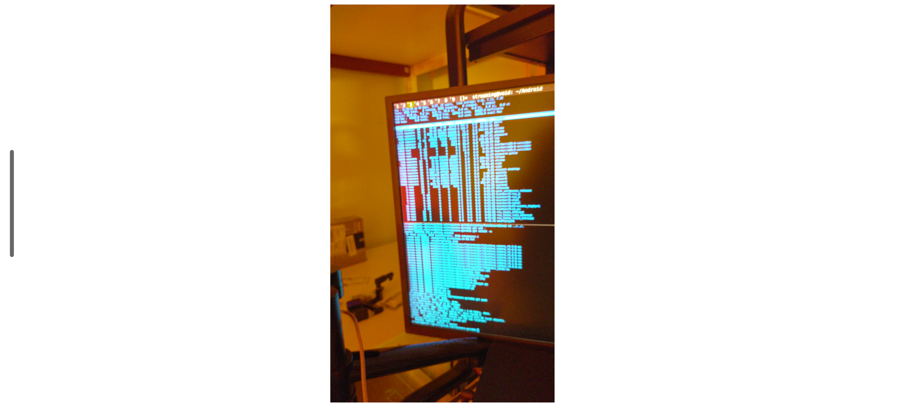

# NDK

This is an attempt to make to work the NDK Go-bindings left in old repository github.com/gooid/gooid.

I haven't tried the provided examples, but I copied camera-related files from `Camera2Demo` into `FyneCameraDemo` and made it work using [`fyne`](https://github.com/fyne-io/fyne) to package it for Android:

[FyneCameraDemo](https://github.com/xaionaro-go/ndk/tree/master/examples/FyneCameraDemo)

To try it:
```sh
go install fyne.io/fyne/v2/cmd/fyne@latest

cd ./examples/FyneCameraDemo
~/go/bin/fyne package -os android/arm64
```

And when I've launched the app, I got this:


---

# OLD `README.md (originally from github.com/gooid/gooid)

## Go bindings for Android NDK
用 Go 开发 APK

### [基本编译环境](https://github.com/gooid/gooid/wiki/%E5%9F%BA%E6%9C%AC%E7%BC%96%E8%AF%91%E7%8E%AF%E5%A2%83)

### 示例应用
#### [Storage demo](https://github.com/gooid/gooid/tree/master/examples/AssetDemo)


#### [Sensor demo](https://github.com/gooid/gooid/tree/master/examples/SensorDemo)


#### [Record demo](https://github.com/gooid/gooid/tree/master/examples/Record)


#### [Camera demo](https://github.com/gooid/gooid/tree/master/examples/CameraDemo)


#### [FaceDetect](https://github.com/gooid/gooid/tree/master/examples/FaceDetect)


